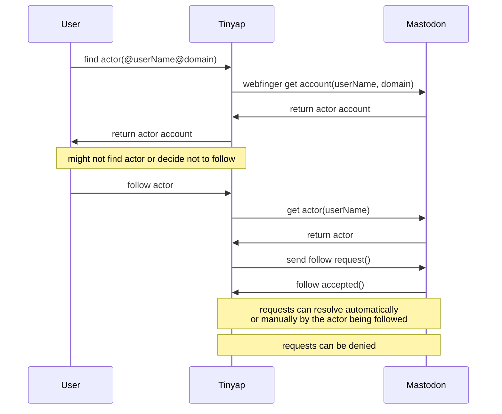

```mermaid
sequenceDiagram
    User->>Tinyap: find actor(@userName@domain) 
    Tinyap->>Mastodon: webfinger get account(userName, domain)
    Mastodon->>Tinyap: return actor account
    Tinyap->>User: return actor account
    Note over User,Tinyap: might not find actor or decide not to follow
    User->>Tinyap: follow actor
    Tinyap->>Mastodon: get actor(userName)
    Mastodon->>Tinyap: return actor
    Tinyap->>Mastodon: send follow request()
    Mastodon->>Tinyap: follow accepted()
    Note over Tinyap,Mastodon: requests can resolve automatically<br> or manually by the actor being followed
    Note over Tinyap,Mastodon: requests can be denied
```